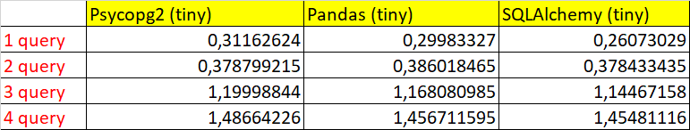
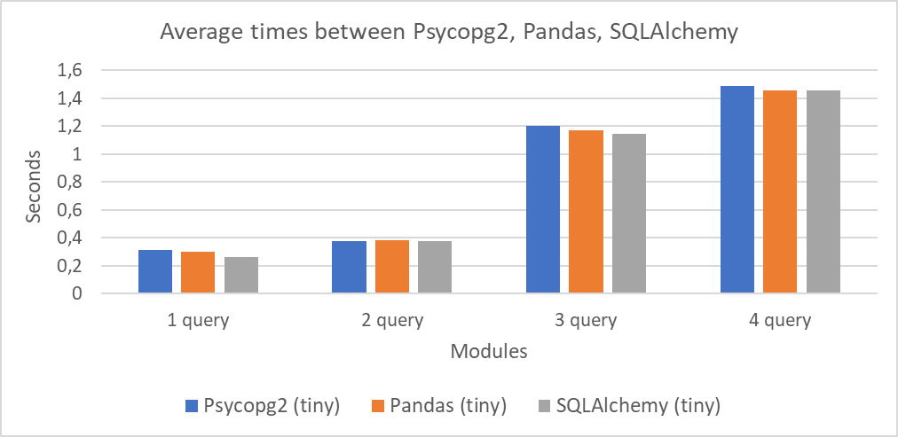
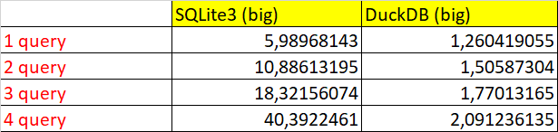
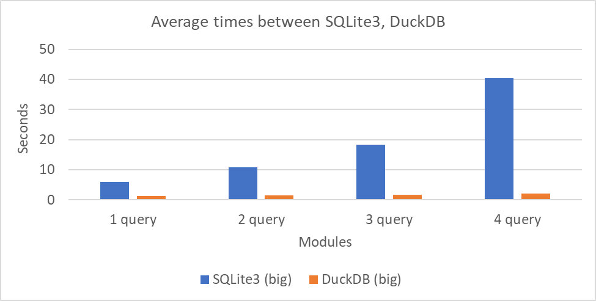

# Benchmark "Taxi"

## Table of contents

- [Table of Contents](#table-of-contents)
- [1. About the benchmark](#1-about-the-benchmark)
- [2. Implementation](#2-implementation)
   - [2.1 Running the program](#21-running-the-program)
   - [2.2 Main script](#22-main-script)
   - [2.3 Results](#23-results)
   - [2.4 Comments about modules](#24-comments-about-modules)
- [3. Conclusion](#3-conclusion)

***

## 1. About the benchmark

`Database benchmarking` is a proven and well-defined method for analyzing and comparing the performance characteristics of databases or database management systems (DBMS).
**_Main objectives of the benchmark_:**
* **_<ins>Performance assessment:</ins>_** helps evaluate the speed of a system, software or components.
* **_<ins>System comparison:</ins>_** allows you to compare the performance of different systems or components under the same conditions.
* **_<ins>Measuring Improvements:</ins>_** allows you to measure the effectiveness of changes, such as software or hardware updates.
* **_<ins>Standardized Tests:</ins>_** provides a set of standardized tests for objective performance comparison.
* **_<ins>Defining Baseline Performance:</ins>_** serves as a starting point for understanding a system's performance and ability to handle tasks.
* **_<ins>Decision Making:</ins>_** helps you make informed decisions based on quantitative performance data.

In this work, a benchmark called `Taxi` is implemented. More details [here](https://medium.com/m/global-identity-2?redirectUrl=https%3A%2F%2Fmedium.unum.cloud%2Fpandas-cudf-modin-arrow-spark-and-a-billion-taxi-rides-f85973bfafd5). It is written by using `Python` and includes the following libraries for working with databases:

* [Psycopg2](https://www.psycopg.org/docs/)
* [SQLite3](https://docs.python.org/3/library/sqlite3.html)
* [Pandas](https://pandas.pydata.org/docs/)
* [SQLalchemy](https://docs.sqlalchemy.org/en/20/)
* [Duckdb](https://duckdb.org/docs/)

Let's also consider queries for this benchmark:

1. This query counts the number of records in the `trips` table for each unique value in the `VendorID` column and groups the results by taxi type (`VendorID`).

```SQL
SELECT "VendorID", COUNT(*) FROM "trips" GROUP BY 1;
```

2. This query calculates the average trip cost (`total_amount`) for each unique passenger count (`passenger_count`) in the `trips` table.

```SQL
SELECT "passenger_count", AVG("total_amount") FROM "trips" GROUP BY 1;
```

3. This query retrieves information from the `trips` table about the number of passengers (`passenger_count`), the year by which the taxi was picked up (`tpep_pickup_datetime`), and counts the number of records corresponding to each unique value of the combination of the number of passengers and the year of pick-up Taxi.

```SQL
SELECT "passenger_count", EXTRACT(year FROM "tpep_pickup_datetime"), COUNT(*)
FROM "trips" GROUP BY 1, 2;
```

4. This query retrieves information from the trips table about the number of passengers (`passenger_count`), the year in which the taxi was taken (`tpep_pickup_datetime`), the rounded trip distance (`trip_distance`) and counts the number of records for each unique combination of these parameters. The results are sorted by the year the taxi was taken in ascending order, and the number of entries in each group is sorted in descending order.

```SQL
SELECT "passenger_count", EXTRACT(year FROM "tpep_pickup_datetime"), ROUND("trip_distance"),
COUNT(*) FROM "trips" GROUP BY 1, 2, 3 ORDER BY 2, 4 DESC;
```

## 2. Implementation

### 2.1 Running the program

1. Clone the repository and install the modules mentioned in this benchmark as needed. Installation occurs via `pip install` + library name.
2. Create a folder to store the data and the `.db` file. You can download all the sources [here](https://drive.google.com/drive/folders/1usY-4CxLIz_8izBB9uAbg-JQEKSkPMg6). Please note that the source contains an error (two identical columns), which was corrected in the program code.
3. Open the `config.py` file and set all the necessary parameters to run the code. The script for this file is presented below.
4. Open the `main.py` file and run the program on the required libraries. The final result will be output to the console.

```py
from sqlalchemy import create_engine, text
import psycopg2
import sqlite3 as sq
import pandas as pd
import duckdb as dck
import pathlib
from pathlib import Path

# Flags to run and number of runs
RUNS = 20
Psycpog2 = False
SQLite3 = False
Pandas = False
SQLAlchemy = False
DuckDB = False

# Information to connect to PostgreSQL
host = ""  # name of host
port = ""  # number of port
user = ""  # name of user
password = ""  # password for PostgreSQL
db_name = ""  # name of database in PostgreSQL

# Information about data
name_table = "" 
nameDBFile = "" 
nameCSVBig = ""
nameCSVTiny = ""
folder_with_data = "" 

# Additional information
work_path = pathlib.Path.cwd()
pathCSVBig = Path(work_path, folder_with_data, nameCSVBig)
pathCSVTiny = Path(work_path, folder_with_data, nameCSVTiny)
pathDB = f"{folder_with_data}/{nameDBFile}"
serverPath = f"postgresql://{user}:{password}@{host}:{port}/{db_name}"
```

### 2.2 Main script

```py
from config import *
import funcs
import Psycopg2Test
import SQLiteTest
import PandasTest
import SQLAlchemyTest
import DuckDBTest

funcs.load_db()
if Psycpog2: print('Psycopg2 times:', Psycopg2Test.RunQueries())
if SQLite3: print('SQLite3 times:', SQLiteTest.RunQueries())
if Pandas: print('Pandas times:', PandasTest.RunQueries())
if SQLAlchemy: print('SQLAlchemy times:', SQLAlchemyTest.RunQueries())
if DuckDB: print('DuckDB times:', DuckDBTest.RunQueries())
```

The main script `main.py` contains the information needed to run it, and also calls functions from the `funcs.py` module internally. All information is loaded into the database using the `load_db` function using the **pandas** module. After this, depending on the selected flags, queries for the modules are executed one by one. Each `.py` file created for each individual library contains a `RunQueries` function, which organizes the work to measure the running time of each request using the `perf_counter` function from the `time` module. One query was tested **20 times** (see requests [here](#1-about-the-benchmark)). Based on the results, graphs were built in Excel showing the dependence of the query execution time for each of the libraries. 

### 2.3 Results

* Результаты работы на небольшом файле с графиком (`nyc_yellow_tiny.csv`):





* Результаты работы на большом файле с графиком (`nyc_yellow_big.csv`):





### 2.4 Comments about modules

#### Psycopg2


**Psycopg2** is a `PostgreSQL` database driver used to perform operations on PostgreSQL using Python. Psycopg2 is one of the most popular and stable modules for working with `PostgreSQL`. 
This module contains many functions for a variety of actions: creating tables and writing data to them, executing SQL queries. In addition, it supports transactions and loading data from a `csv file`. Psycopg2 supports various PostgreSQL data types, including numbers, strings, binary data, and even arrays. It has good performance, _second only to DuckDB_. Of course, not all library capabilities were considered in this work, so this time could be better due to various optimization methods.

#### SQLite3


`SQLite` is a fast and lightweight embedded single-file DBMS that does not have a server and allows you to store the entire database locally on one device. If we talk about the module itself, then **SQLite3** is a very easy and intuitive to use built-in Python library. It has good performance, but does not provide automatic completion of data from files. Working with this module did not cause any difficulties. In terms of performance, it can be said that it is significantly inferior to DuckDB on a big file `nyc_yellow_big.csv`, but there are many ways to make SQLite faster.

#### Pandas


**Pandas** is a popular Python software library that is widely used for data processing. It is based on the `NumPy` library and provides convenient and efficient tools for working with large amounts of data, allowing you to easily and flexibly perform table operations. Pandas is one of the most convenient tools for data processing. In my work it was used to read and write `.csv` files to databases. Pandas has a user-friendly interface and intuitive features. It allows you to both read SQL queries and execute them through built-in functions. In terms of speed, pandas is on par with psycopg2, although in principle all actions could be carried out with `DataFrame` objects, however, it may not always be enough.

#### SQLAlchemy


**SQLAlchemy** is a Python library that allows you to work with relational databases using `ORM`. ORM allows you to work with a database using object-oriented code, without using SQL queries. Because of this feature, it is impossible to accurately evaluate this module, since _there was no need to create classes_ in this work. However, this module works the same way as psycopg2 due to the connection to PostgreSQL and does not load the DBMS itself.

#### DuckDB


**DuckDB** is an SQL-embedded `OLAP-system` (online analytical processing) database management system. DuckDB is a great option if you need a serverless DBMS for data analysis. It has high speed due to _vectorization of query execution_ (column orientation). This is an undoubted advantage, which leads to the fact that this module is used in analytics tasks and working with large volumes of data. According to the launch results, `duckdb` showed the best time, being many times ahead of other libraries. I found this module quite easy to understand and convenient. It has a wide range of functions and in particular a built-in way to load information from a csv file.

## 3. Conclusion

As a result of this laboratory work, a benchmark was written for _5 libraries_ of the Python programming language. Based on the results of the work, we can say that all libraries showed different query execution times. The choice of any library for working with databases directly depends on the goals and conditions of a given project. The `duckdb` module turned out to be the fastest and most efficient. The reason for this performance is that DuckDB is designed specifically to handle analytical queries involving large amounts of data. The next most productive module was the `psycopg2` module, which works with PostgreSQL. This DBMS is a highly optimized product for working with data and has made a good name for itself. This module, together with the database, is well suited for large projects, since the capabilities provided are truly enormous. `sqlite3` showed the worst performance, despite its simplicity. In SQLite, all data is stored in one file and access occurs at a fairly fast speed, but the lack of a server can be a serious problem when working. This library is best suited for small projects, particularly those related to running mobile applications. The other libraries `pandas` and `sqlalchemy` also showed good performance and are very convenient tools for working with data. The first is good in convenient functions and speed, while the second has a feature - ORM, applicable in various frameworks. In conclusion, it can be noted that this work revealed to me the enormous possibilities of database management using Python!